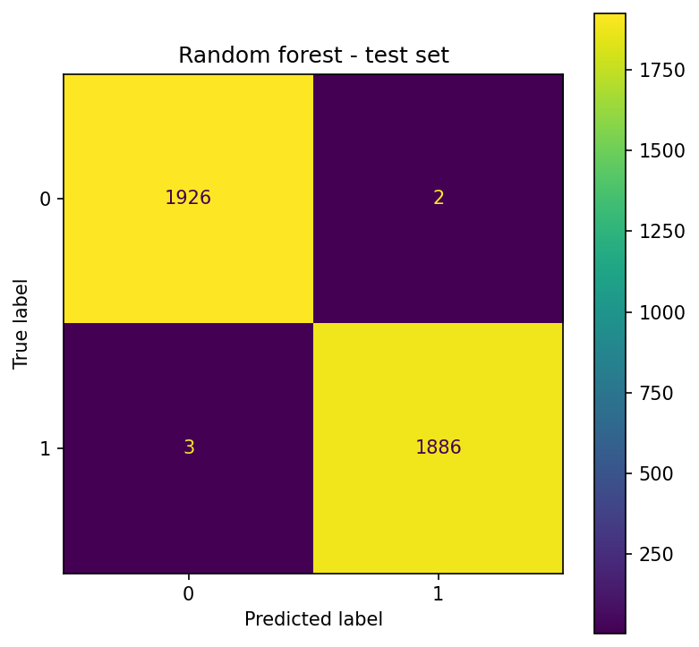
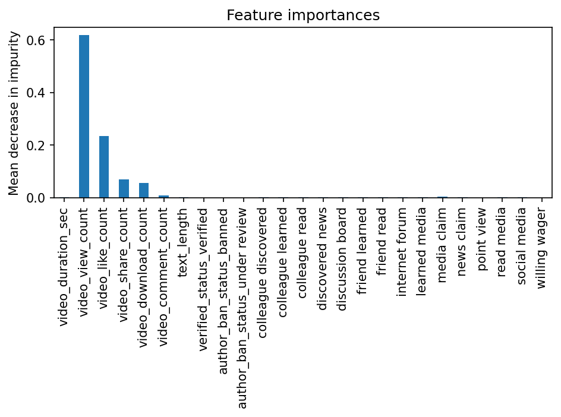

# TikTok Claim vs Opinion Detection (Data Analyst Intern Project)

> **One‑liner:** Classify TikTok texts as **Claim vs Opinion** to prioritize fact‑checking and cut manual moderation time.

## Table of Contents
- [TL;DR](#tldr)
- [Business Problem](#business-problem)
- [Data](#data)
- [Methodology](#methodology)
- [Results](#results)
- [Reproducibility](#reproducibility)
- [Project Structure](#project-structure)
- [Limitations & Ethics](#limitations--ethics)
- [Next Steps](#next-steps)
- [Credits](#credits)

## TL;DR
- **Data:** N = 19084 videos (text + creator/account metadata).
- **Methods:** n‑gram text features + classic ML (logistic baseline) with hold‑out test.
- **KPI:** prioritize **Recall(Claim)** with balanced F1.
- **Result:** **Accuracy = 0.99** on test; **F1 (Claim) = 0.99**, **Recall (Claim) = 0.99**.

## Business Problem
Moderation teams need to **catch claims early** to route fact‑checking. Missing a claim is costly (escalations, misinformation risk).  
**Objective:** maximize **Recall(Claim)** while keeping overall F1 balanced for stable operations.

## Data
- **Path:** `data/tiktok_dataset.csv` (not committed; use a small sample if needed)  
- **Shape:** 19084 rows × 12 columns (see schema).  
- **Target:** `claim_status` ∈ {`claim`, `opinion`}.  
- **Test set:** 3817 rows; class counts — claim: 1925, opinion: 1892 (≈ 50/50).

### Schema (abridged)
| Column | Dtype | Description |
|---|---|---|
| `#` | `int64` | row index from source |
| `claim_status` | `object` | ground truth label: 'claim' or 'opinion' |
| `video_id` | `int64` | unique video identifier |
| `video_duration_sec` | `int64` | video length in seconds |
| `video_transcription_text` | `object` | ASR text |
| `verified_status` | `object` | account verification flag |
| `author_ban_status` | `object` | creator ban status |
| `video_view_count` | `float64` | views |
| `video_like_count` | `float64` | likes |
| `video_share_count` | `float64` | shares |
| `video_download_count` | `float64` | downloads |
| `video_comment_count` | `float64` | comments |

**Privacy:** texts are anonymized; no PII is committed to this repo.

## Methodology
1. **EDA:** label balance; text length distributions; slices by verified_status and author_ban_status.  
2. **Preprocessing:**  
   - Vectorization: CountVectorizer / TfidfVectorizer on video_transcription_text with n-grams (2–3) and English stopwords.
   - Categoricals: encoded via pd.get_dummies(...) (không dùng ColumnTransformer).
   - One‑hot encode selected categorical fields (e.g., `author_ban_status`); numeric features standardized if used.  
3. **Modeling:** XG Boost and Random Forest model, the final model is Random Forest model.  
4. **Validation:** hold-out split test; fixed `random_state` for reproducibility.  
5. **Evaluation:** classification_report (precision/recall/F1 per class), Recall(Claim) as the primary KPI, plus overall accuracy and confusion_matrix.

## Results
| Metric | Value |
|---|---|
| Accuracy (test) | 1.00 |
| F1 — Claim | 1.00 |
| Recall — Claim | 1.00 |
| Precision — Claim | 1.00 |
| F1 — Opinion | 1.00 |

The classification report above shows that the random forest model scores were perfect, but we know they weren't quite perfect. The confusion matrix indicates that there were 10 misclassifications&mdash;five false postives and five false negatives.

Figure for random forest model:





## Reproducibility
```bash
# 1) Create env
python -m venv .venv && source .venv/bin/activate   # Windows: .venv\Scripts\activate
pip install -r requirements.txt

# 2) Run the notebook (interactive)
# open project.ipynb and run all cells

You can explore the full notebook output without running the code or Github can not run the code block:
**Live HTML report:** [Open Report](https://bumbumlinh91.github.io/tiktok-project/project.html)

```

**Data expectation:** place a CSV at `data/tiktok_dataset.csv` with at least the schema above.  
**Determinism:** set `random_state=0` (already in the notebook).

## Project Structure
```
tiktok-project/
│
├── data/ # Dataset used in the project
│ └── tiktok_dataset.csv
│
├── docs/ # Documentation & exported reports
│ └── project.html
│
├── images/ # Figures generated by the analysis
│ ├── confusion_matrix.png
│ ├── feature_importances.png
│
├── project.ipynb # Main Jupyter notebook
└── requirements.txt # Project dependencies
```

## Limitations & Ethics
- **Text + simple metadata only**: no audio/video features — some context is lost.
- **Domain drift**: TikTok language shifts quickly; retrain/monitor regularly.
- **Bias risk**: author metadata (e.g., `verified_status`, `author_ban_status`) can encode demographic/behavioral bias — audit before production.


## Next Steps
- **Validation for Recall(Claim)**: use `StratifiedKFold` (e.g., 5-fold) and report mean ± std of **Recall(Claim)**.
- **Threshold tuning**: optimize decision threshold for **Recall(Claim)** under a precision/FPR constraint; add precision–recall curve.
- **Calibration**: apply `CalibratedClassifierCV` (isotonic) for better confidence scores.
- **Modeling**: replace n-gram counts with lightweight transformer embeddings (e.g., `distilbert-base-uncased`) or sentence embeddings + XGBoost; consider distillation for speed.
- **Error analysis**: dedicated **false-negative** table for Claim; sample-wise review to refine preprocessing.
- **Ops**: add a minimal Streamlit reviewer dashboard to inspect predictions and audit FN/FP.

## Credits
Built by **Linh** — Data Analyst (Intern) candidate.  
**Models:** XGBoost & Random Forest (main), Logistic Regression (baseline).  
**Data:** TikTok text + public engagement fields (no audio/video; no PII committed).
